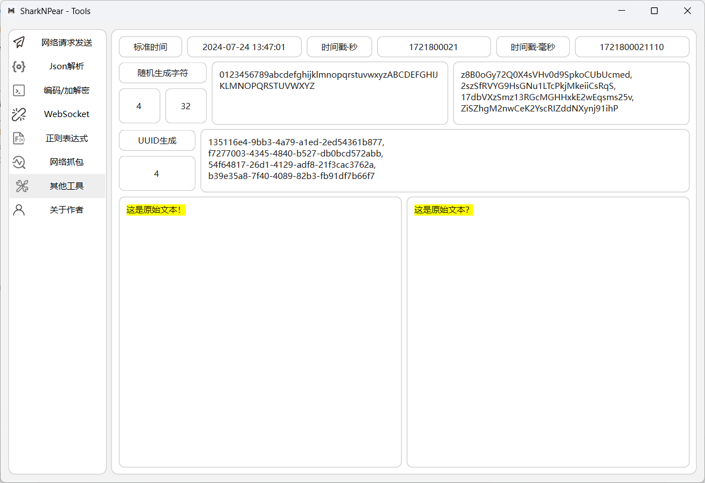

<h1 align="center">SharkNPear</h1>
<p align="center">
  
  
  
  
  
</p>
<hr>

# SharkNPear

## 📚 程序简介

本程序使用 Python+PyQt6 开发的 GUI 网络工具、是一款支持网络请求发送、Json 解析、编码/加解密、WebSocket 测试、正则表达式、网络抓包以及其他工具的开源 GUI 程序.

## 💡 功能介绍

- 网络请求发送：支持 GET、POST、HEAD、PUT、DELETE、OPTIONS、PATCH.支持导入 Curl 于 Raw 格式数据转化请求，以及支持生成 Python、PHP、Java、Shell 请求代码.
- Json 解析：支持格式化 Json 数据、转义 Json、Json 转化解析树.
- 编码/加解密：适配常见编码，加解密模式.如 Hash(哈希值)生成、Url 编码、Base64 编/解码、AES、DES、RSA、HMAC、3DES、Unicode、JWT、String 与 Hex 互转.
- WebSocket 连接：使用 websocket 库支持设置发送信息及请求协议设置.
- 正则表达式：拥有常见的正则表达式一键导入，正则表达式在线匹配显示.
- 网络抓包：使用 mitmproxy 库进行网络 http(https)协议抓包、支持自定义端口、支持查看请求协议头、请求数据以及响应协议头以及响应数据.
- 其他工具：实时显示当前标准时间、时间戳、毫秒时间戳、随机生成字符、UUID 生成以及文本对比显示.

## ⚡ 程序环境

SharkNPear 项目依赖包主要版本如下：

| 技术             | 描述           | 版本   |
| ---------------- | -------------- | ------ |
| Python           | 编程语言       | 3.11.5 |
| PyQt6            | GUI 框架       | 6.7.0  |
| mitmproxy        | HTTPS 代理工具 | 10.3.1 |
| websocket-client | WebSocket 协议 | 1.6.3  |
| pycryptodome     | 加/解密框架    | 3.20.0 |

## 🚀 运行程序

- 运行配置

安装配置环境

```shell
pip install -r requeirements.txt
```

运行程序

```shell
python run.py
```

## 🚀 网络抓包配置

由于本项目使用的是 mitmproxy 作为中间商代理程序，所以需要配置一下 mitmproxy 的证书，具体操作如下：

- 点击"安装证书.bat"文件，系统设置代理为对应的 8888 端口
- 刷新网页，选择对应的系统版本的 p12 文件下载安装打开
- 选择当前用户，默认下一步
- 在证书存储选择：将所有的证书都放入下列存储-受信任的根证书颁发机构
- 即可完成证书的安装
- 证书完成安装后可将同目录下的"mitmproxy"文件夹删除

## 👀 程序界面 UI

<table>
    <tr>
        <td></td>
        <td></td>
    </tr>
    <tr>
        <td></td>
        <td></td>
    </tr>
    <tr>
        <td></td>
        <td></td>
    </tr>
	<tr>
        <td></td>
        <td></td>
</table>

## 💻 项目统计

[](https://star-history.com/#PearNoDec/SharkNPear&Date)

## ⭐️ 交流地址

<div>
    
</div>
```
